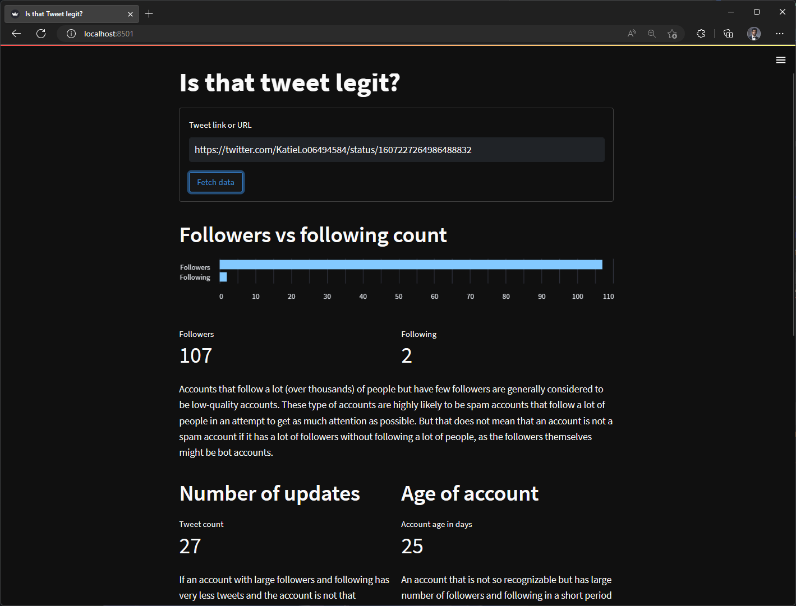
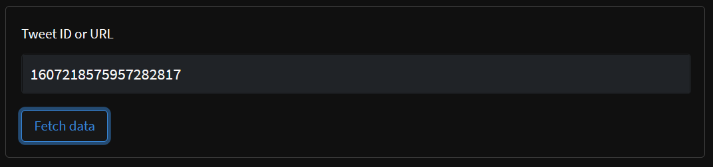
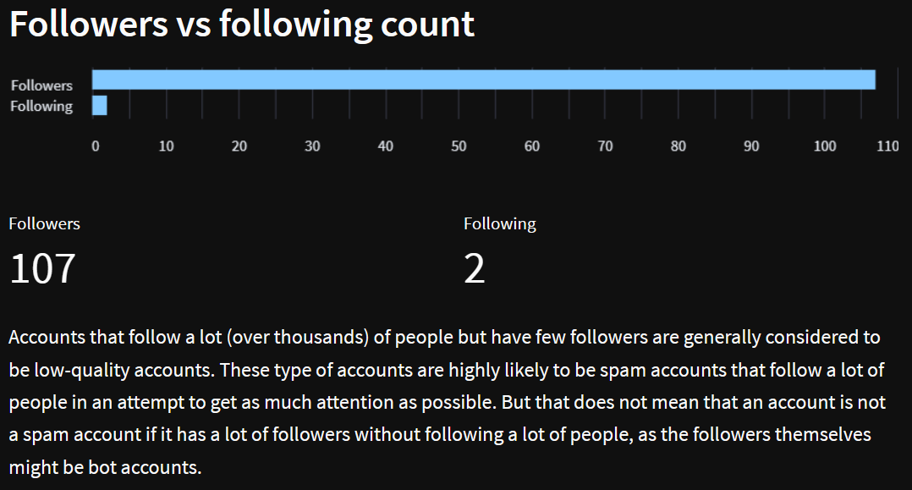
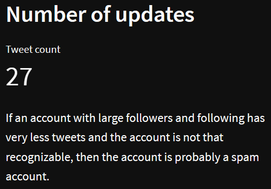
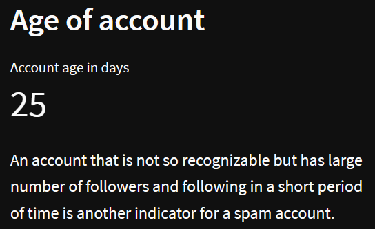
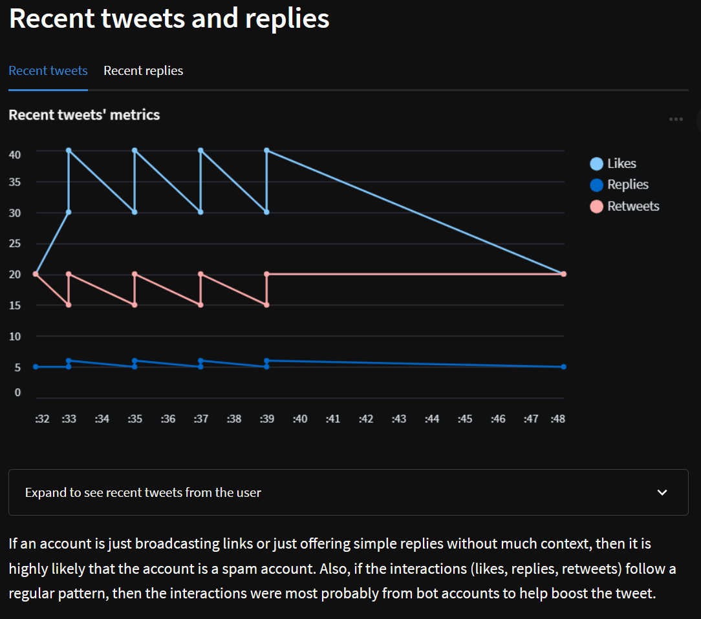

# Is that Tweet legit?

An application built with [Streamlit](https://streamlit.io/) that pulls data from the
official [Twitter API](https://developer.twitter.com/en/docs/twitter-api), extracts relevant information and displays
them as metrics and chart to help the user identify if the tweet comes from a spam account or not.

## Features walkthrough

### Tweet link input

The user can grab the link of the tweet from the address bar and paste it in the 'Tweet ID or URL' text input to
fetch relevant data.

### Followers and following count

Shows the followers and following count information as bar chart and metrics. Also shows description on what the user
should look out for in these metrics in order to judge whether an account is a spam account.

### Number of tweets

Show the number of tweets that the account has tweeted. Also shows description on what the user should look out for in
this metric to in order judge whether an account is a spam account.

### Account age

Shows how old is the account in days. Also shows description on what the user should look out for in this metric to in
order judge whether an account is a spam account.

### Recent tweets and replies information

Shows metrics (likes, replies, retweets) for recent tweets and replies as a line chart. Also given an option to show
recent tweets and replies that were fetched for the chart. User can click on the tabs to switch between recent tweets
and recent replies information. Also shows description on what the user should look out for in these metrics in order
to judge whether an account is a spam account.
